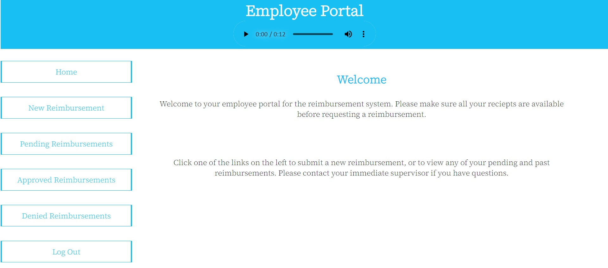
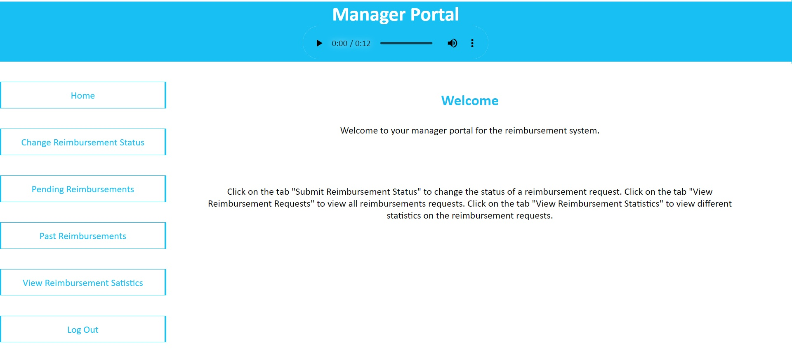

# Project 1: Reimbursements

This is a project that features the ability to create and review reimbursements. Employees of a this fictional company can request reimbursements for things they bought for the sake of work. Managers of those employees can accept or reject the reimbursement requests depending on whether or not they believe the requests are legitimate.

### User Stories
- Employees
    - As an employee, I should be able to login so hat I can manage my reimbursements.
    - As an employee, I should be able to submit new reimbursement requests so that I can get money back from the company.
    - As an employee, I should be able to review my reimbursement requests so thatI can know if they are approved or denied.
    - As an employee, I should be able to logout so that my information does not remain available on my computer.
- Managers
    - As a manager, I should be able to login so that I can approve or deny reimbursements.
    - As a manager, I should be able to approve reimbursement requests because they are legitamate.
    - As a manager, I should be able to deny reimbursement requests because they are illegitamate.
    - As a manager, I should be able to leave a comment about my decisions regarding reimbursement requests so that employees better understand my decisions.
    - As a manager, I should be able to view pending reimbursement requests so that I can make decisions about them.
    - As a manager, I should be able to view past reimbursement requests so that I can check previous decisions.
    - As a manager, I should be able to view reimbursement statistics so that I can keep track of employee acitvities.
    - As a manager, I should be able to log out so that my information does not remain available on my computer.
- System
    - As the system, I should reject failed login attempts.
    - As the system, I should reject negative values for reimbursement requests.
    - As the system, I should reject non-numeric values for reimbursement requests.

### Technologies
- PyCharm
- GitHub
- Git Bash
- pytest
- psycopg binary
- Flask
- behave
- Gherkin
- Cucumber
- selenium

These are the tables I created in the database for this project.

These are the webpages for this project. First the employee portal and then the manager portal:

